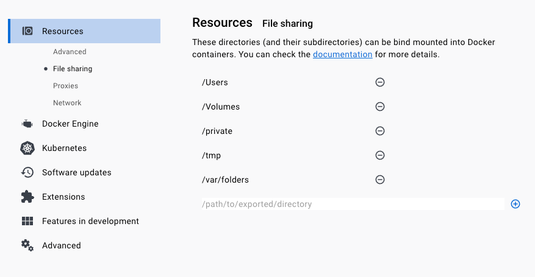

**Full Walkthrough**
https://www.youtube.com/watch?v=Gd9bvdkIXOQ

**Set PUID + PGID**
in terminal type ``id`` take the value of the user you are using as the host docker

**Default username is** 
abc

**Set password**
edit the .env file to the value you want

```PASSWORD=pasword123```

**Set Docker Desktop to allow the shared folder**


You basically want to treat this as a VM from here on out as updating to the base container will lose your config unless you add the setup into the docker-compose